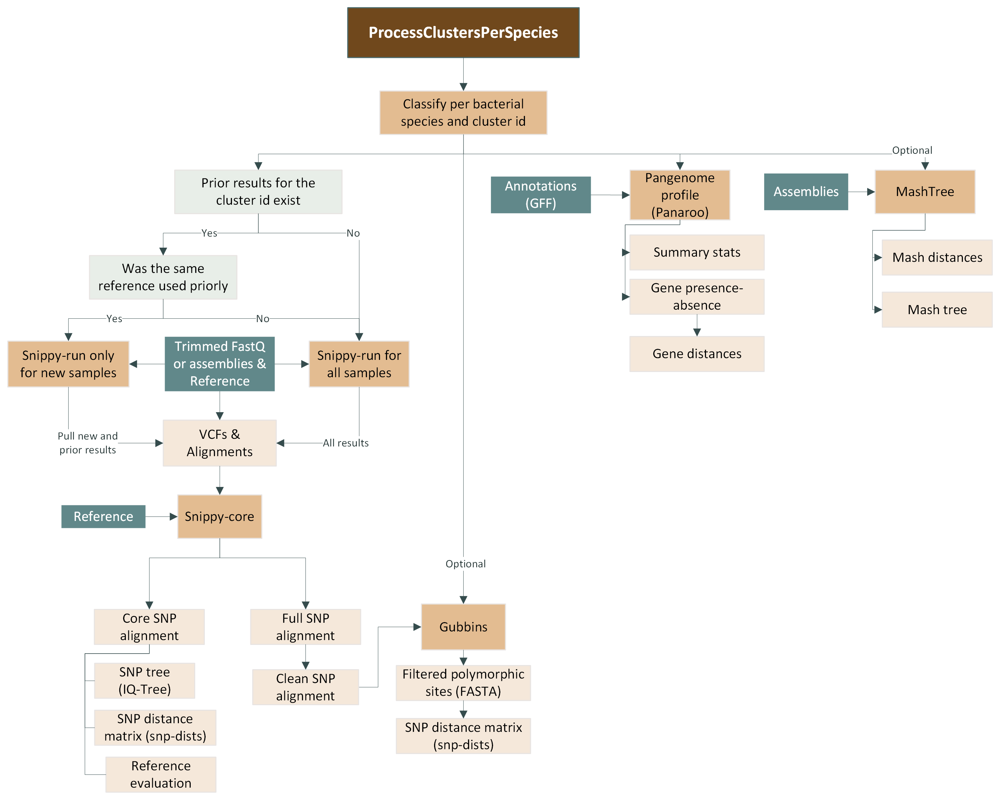

#  

[](https://www.nextflow.io/)
[](https://docs.conda.io/en/latest/)
[](https://www.docker.com/)
[](https://sylabs.io/docs/)


## Introduction

**process-bact-cluster-per-species** is a bioinformatics best-practice analysis pipeline for phylogenetic analysis of bacterial clusters. This pipleine includes Snippy run, Snippy core, Gubbins (optional), Panaroo and MashTree (optional).

The pipeline is built using [Nextflow](https://www.nextflow.io), a workflow tool to run tasks across multiple compute infrastructures in a very portable manner. It uses Docker/Singularity containers making installation trivial and results highly reproducible. The [Nextflow DSL2](https://www.nextflow.io/docs/latest/dsl2.html) implementation of this pipeline uses one container per process which makes it much easier to maintain and update software dependencies. Where possible, these processes have been submitted to and installed from [nf-core/modules](https://github.com/nf-core/modules) in order to make them available to all nf-core pipelines, and to everyone within the Nextflow community!

## Pipeline summary

1. Identify reference-based SNPs with [`Snippy`](https://github.com/tseemann/snippy)-run for each sample.
2. Make a core genome alignment with [`Snippy`](https://github.com/tseemann/snippy)-core, generate a SNP tree with [`IQ-TREE`](https://www.iqtree.org/) and calculate SNP distances with [`snp-dists`](https://github.com/tseemann/snp-dists).
3. Mask recombinant sites with [`Gubbins`](https://github.com/nickjcroucher/gubbins) and calculate SNP distances with [`snp-dists`](https://github.com/tseemann/snp-dists) (optional).
4. Pangenome profile (gene presence-absence) with [`Panaroo`](https://github.com/gtonkinhill/panaroo) and calculate gene distances.
5. Make a tree with Mash distances using [`MashTree`](https://github.com/lskatz/mashtree) (optional).
6. Summary results ([`MultiQC`](http://multiqc.info/))




## Quick Start

1. Install [`Nextflow`](https://www.nextflow.io/docs/latest/getstarted.html#installation) (`>=22.10.1`)

2. Install any of [`Docker`](https://docs.docker.com/engine/installation/), [`Singularity`](https://www.sylabs.io/guides/3.0/user-guide/) (you can follow [this tutorial](https://singularity-tutorial.github.io/01-installation/)), [`Podman`](https://podman.io/), [`Shifter`](https://nersc.gitlab.io/development/shifter/how-to-use/) or [`Charliecloud`](https://hpc.github.io/charliecloud/) for full pipeline reproducibility _(you can use [`Conda`](https://conda.io/miniconda.html) both to install Nextflow itself and also to manage software within pipelines. Please only use it within pipelines as a last resort; see [docs](https://nf-co.re/usage/configuration#basic-configuration-profiles))_.

3. Clone this repository and test it on a minimal dataset with a single command:

   ```bash
   nextflow run process-bact-clusters-per-species/main.nf -profile test,YOURPROFILE --outdir <OUTDIR>
   ```

   Note that some form of configuration will be needed so that Nextflow knows how to fetch the required software. This is usually done in the form of a config profile (`YOURPROFILE` in the example command above). You can chain multiple config profiles in a comma-separated string.

   > - The pipeline comes with config profiles called `docker`, `singularity`, `podman`, `shifter`, `charliecloud` and `conda` which instruct the pipeline to use the named tool for software management. For example, `-profile test,docker`.
   > - Please check [nf-core/configs](https://github.com/nf-core/configs#documentation) to see if a custom config file to run nf-core pipelines already exists for your Institute. If so, you can simply use `-profile <institute>` in your command. This will enable either `docker` or `singularity` and set the appropriate execution settings for your local compute environment.
   > - If you are using `singularity`, please use the [`nf-core download`](https://nf-co.re/tools/#downloading-pipelines-for-offline-use) command to download images first, before running the pipeline. Setting the [`NXF_SINGULARITY_CACHEDIR` or `singularity.cacheDir`](https://www.nextflow.io/docs/latest/singularity.html?#singularity-docker-hub) Nextflow options enables you to store and re-use the images from a central location for future pipeline runs.
   > - If you are using `conda`, it is highly recommended to use the [`NXF_CONDA_CACHEDIR` or `conda.cacheDir`](https://www.nextflow.io/docs/latest/conda.html) settings to store the environments in a central location for future pipeline runs.

4. Prepare a Manifest CSV File

Create a CSV file containing paths to the following: QC-trimmed FASTQ files, GFFs, assemblies, cluster_id, species, and reference. Snippy supports inputs in three formats: paired-end reads, single-end reads, or assemblies. 

- **Paired-end reads**: Include paths for both `fastq_1` and `fastq_2`.
- **Single-end reads**: Leave the `fastq_2` column blank.
- **Assemblies only**: Leave both `fastq_1` and `fastq_2` columns blank.

The following columns are **mandatory**:
- `sample`
- `gff`
- `assembly`
- `cluster_id`
- `species`
- `reference`

Make sure to provide values for these columns even if certain input types do not require `fastq` paths.

| sample                 | fastq_1                                              | fastq_2                                              | gff                      | assembly                     | cluster_id          | species                   | reference                          |
|------------------------|-----------------------------------------------------|-----------------------------------------------------|--------------------------|------------------------------|---------------------|---------------------------|------------------------------------|
| SAMPLE_1_PAIRED_END    | /path/to/qc/trimmed/fastq/files/SAMPLE1_1.trim.fastq.gz | /path/to/qc/trimmed/fastq/files/SAMPLE1_1.trim.fastq.gz | /path/to/gff/SAMPLE1.gff | /path/to/assembled/fasta/SAMPLE1.fasta | cluster_1          | Escherichia_coli         | /path/to/assembled/reference/reference1.fasta |
| SAMPLE_2_PAIRED_END    | /path/to/qc/trimmed/fastq/files/SAMPLE2_1.trim.fastq.gz | /path/to/qc/trimmed/fastq/files/SAMPLE2_1.trim.fastq.gz | /path/to/gff/SAMPLE2.gff | /path/to/assembled/fasta/SAMPLE2.fasta | cluster_1          | Escherichia_coli         | /path/to/assembled/reference/reference1.fasta |
| SAMPLE_3_PAIRED_END    | /path/to/qc/trimmed/fastq/files/SAMPLE3_1.trim.fastq.gz | /path/to/qc/trimmed/fastq/files/SAMPLE3_1.trim.fastq.gz | /path/to/gff/SAMPLE3.gff | /path/to/assembled/fasta/SAMPLE3.fasta | outbreak_facilityA | Pseudomonas aeruginosa   | /path/to/assembled/reference/reference2.fasta |
| SAMPLE_4_SINGLE_END    | /path/to/qc/trimmed/fastq/files/SAMPLE4_1.trim.fastq.gz |                                                         | /path/to/gff/SAMPLE3.gff | /path/to/assembled/fasta/SAMPLE4.fasta | outbreak_facilityA | Pseudomonas aeruginosa   | /path/to/assembled/reference/reference2.fasta |
| SAMPLE_5_ASSEMBLED     |                                                     |                                                     | /path/to/gff/SAMPLE5.gff | /path/to/assembled/fasta/SAMPLE5.fasta | outbreak_facilityA | Pseudomonas aeruginosa   | /path/to/assembled/reference/reference2.fasta |
| SAMPLE_6_ASSEMBLED     |                                                     |                                                     | /path/to/gff/SAMPLE6.gff | /path/to/assembled/fasta/SAMPLE6.fasta | outbreak_facilityA | Pseudomonas aeruginosa   | /path/to/assembled/reference/reference2.fasta |
| SAMPLE_7_ASSEMBLED     |                                                     |                                                     | /path/to/gff/SAMPLE7.gff | /path/to/assembled/fasta/SAMPLE7.fasta | cluster_1          | Escherichia_coli         | /path/to/assembled/reference/reference1.fasta |

5. Start running your own analysis!
  ```bash
  nextflow run MI-Bioinformatics/process-bact-cluster-per-species --input samplesheet.csv --outdir <OUTDIR> --gubbins --mashtree -profile <docker/singularity/podman/shifter/charliecloud/conda/institute>
   ```

> [!TIP]
> Check detailed [usage instructions](./docs/usage.md) for the pipeline.

## Input/Output Options
- `--input`                       [string]  Path to comma-separated file containing information about the samples and reference in the analysis (mandatory).
- `--outdir`                      [string]  The output directory where the results will be saved. You must use absolute paths for storage on Cloud infrastructure (mandatory).  
- `--gubbins`                     [boolean] Filter out recombinant sites with Gubbins (optional).
- `--mashtree`                    [boolean] Analyze genomic distances and generate a tree with MashTree (optional).
- `--previous_results`            [string]  Path to previous results. By default, the pipeline looks for prior Snippy results for the same cluster in the outdir (optional). 
- `--save_snippy_run`             [boolean] Do not publish Snippy run results. By default, the pipeline saves the Snippy-run results per sample (optional).
- `--email`                       [string]  Email address for completion summary (optional).
- `--multiqc_title`               [string]  MultiQC report title. Printed as a page header and used for the filename if not otherwise specified (optional).


## Outputs
Below is the structure of the output directory. 

> [!TIP]
> Check detailed [output information](./docs/output.md) for the pipeline.

```
📁 <outdir>
├── 📁 <Species>
│   ├── 📁 clusters
│   │   └── 📁 <cluster_id>
│   │       ├── 📁 snippy_run
│   │       │   ├── 📁 <sample>
│   │       │   │   ├── 📄 <sample>.aligned.fa
│   │       │   │   ├── 📄 <sample>.bam
│   │       │   │   ├── 📄 <sample>.bam.bai
│   │       │   │   ├── 📄 <sample>.bed
│   │       │   │   ├── 📄 <sample>.consensus.fa
│   │       │   │   ├── 📄 <sample>.consensus.subs.fa
│   │       │   │   ├── 📄 <sample>.csv
│   │       │   │   ├── 📄 <sample>.filt.vcf
│   │       │   │   ├── 📄 <sample>.gff
│   │       │   │   ├── 📄 <sample>.html
│   │       │   │   ├── 📄 <sample>.log
│   │       │   │   ├── 📄 <sample>.raw.vcf
│   │       │   │   ├── 📄 <sample>.tab
│   │       │   │   ├── 📄 <sample>.txt
│   │       │   │   ├── 📄 <sample>.vcf
│   │       │   │   ├── 📄 <sample>.vcf.gz
│   │       │   │   └── 📄 <sample>.vcf.gz.csi
│   │       ├── 📁 snippy_core
│   │       │   ├── 📄 <Species>_<cluster_id>_clean.full.aln
│   │       │   ├── 📄 <Species>_<cluster_id>_clean.full.full.aln
│   │       │   ├── 📄 <Species>_<cluster_id>.aln
│   │       │   ├── 📄 <Species>_<cluster_id>.aln.iqtree
│   │       │   ├── 📄 <Species>_<cluster_id>.aln.treefile
│   │       │   ├── 📄 <Species>_<cluster_id>.dist.tsv
│   │       │   ├── 📄 <Species>_<cluster_id>.tab
│   │       │   ├── 📄 <Species>_<cluster_id>.tre
│   │       │   ├── 📄 <Species>_<cluster_id>.txt
│   │       │   └── 📄 <Species>_<cluster_id>.vcf
│   │       ├── 📁 gubbins
│   │       │   ├── 📄 <Species>_<cluster_id>_clean.full.branch_base_reconstruction.embl
│   │       │   ├── 📄 <Species>_<cluster_id>_clean.full.final_bootstrapped_tree.tre
│   │       │   ├── 📄 <Species>_<cluster_id>_clean.full.final_tree.tre
│   │       │   ├── 📄 <Species>_<cluster_id>_clean.full.filtered_plymorphic_sites.fasta
│   │       │   ├── 📄 <Species>_<cluster_id>_clean.full.filtered_plymorphic_sites.phylip
│   │       │   ├── 📄 <Species>_<cluster_id>_clean.full.node_labelled.final_tree.tre
│   │       │   ├── 📄 <Species>_<cluster_id>_clean.full.per_branch_statistics.csv
│   │       │   ├── 📄 <Species>_<cluster_id>_clean.full.recombination_predictions.embl
│   │       │   ├── 📄 <Species>_<cluster_id>_clean.full.recombination_predictions.gff
│   │       │   ├── 📄 <Species>_<cluster_id>_clean.full.summary_of_snp_distribution.vcf
│   │       │   └── 📄 <Species>_<cluster_id>_dists.tsv
│   │       ├── 📁 panaroo
│   │       │   ├── 📄 gene_presence_absence.Rtab
│   │       │   ├── 📄 gene_presence_absence_roary.csv
│   │       │   ├── 📄 gene_presence_dist.tsv
│   │       │   └── 📄 summarystatistics.txt
│   │       ├── 📁 mashtree
│   │       │   ├── 📄 <Species>_<cluster_id>.dnd
│   │       │   └── 📄 <Species>_<cluster_id>.tsv
│   │       └── 📄 reference_evaluation.tsv
├── 📁 pipeline_info
│   ├── 📄 execution_report_<date_time>.html
│   ├── 📄 execution_timeline_<date_time>.html
│   ├── 📄 execution_trace_<date_time>.txt
│   ├── 📄 pipeline_dag_<date_time>.html
│   ├── 📄 samplesheet.valid.csv
│   └── 📄 software_versions.yml
├── 📁 multiqc
│   ├── 📁 multiqc_data
│   ├── 📁 multiqc_plots
│   └── 📄 multiqc_report.html

```

## Credits

process-bact-clusters-per-species was originally written by MDHHS Genomics Analysis Unit with Karla Vasco and Douglas Maldonado-Torres as main mainteiners.


## Citations

An extensive list of references for the tools used by the pipeline can be found in the [`CITATIONS.md`](CITATIONS.md) file.

You can cite the `nf-core` publication as follows:

> **The nf-core framework for community-curated bioinformatics pipelines.**
>
> Philip Ewels, Alexander Peltzer, Sven Fillinger, Harshil Patel, Johannes Alneberg, Andreas Wilm, Maxime Ulysse Garcia, Paolo Di Tommaso & Sven Nahnsen.
>
> _Nat Biotechnol._ 2020 Feb 13. doi: [10.1038/s41587-020-0439-x](https://dx.doi.org/10.1038/s41587-020-0439-x).
