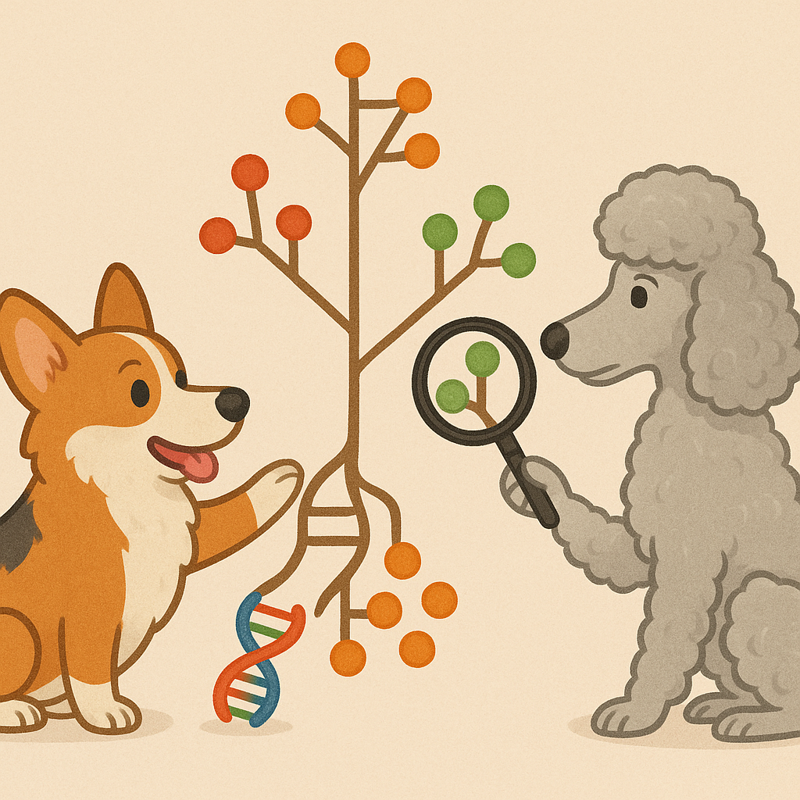
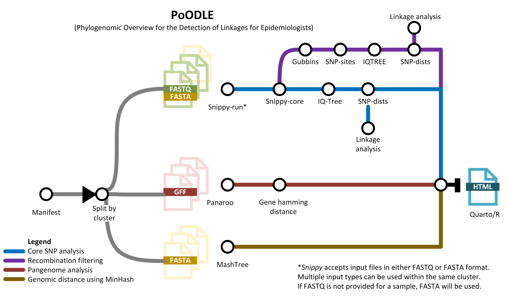
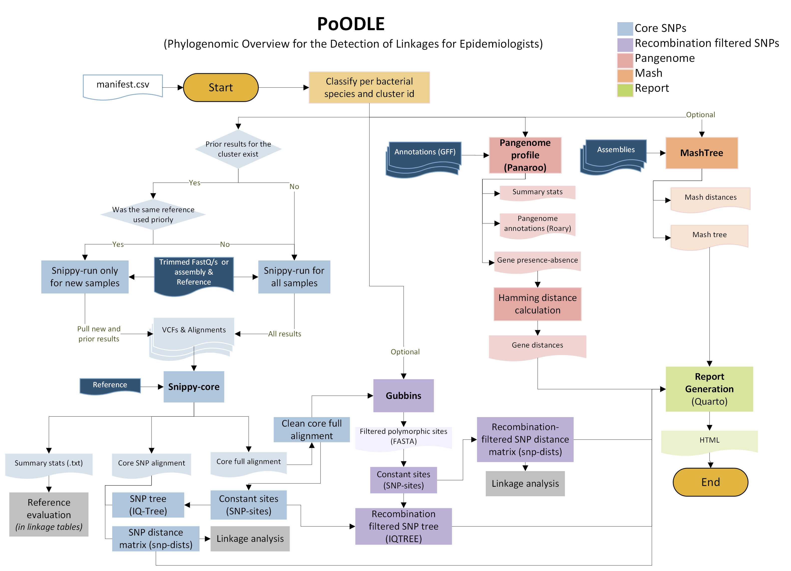
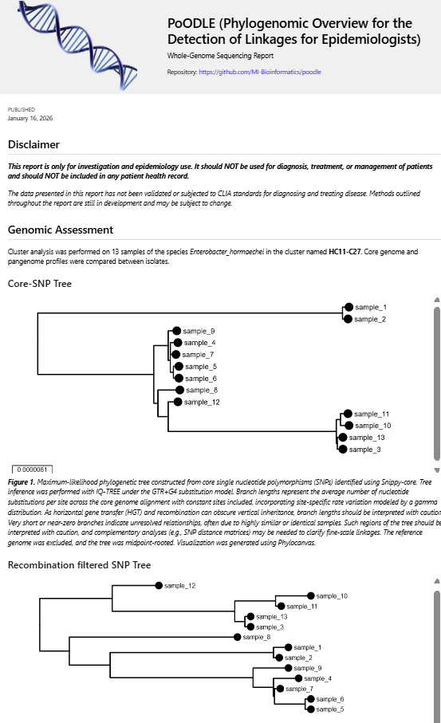
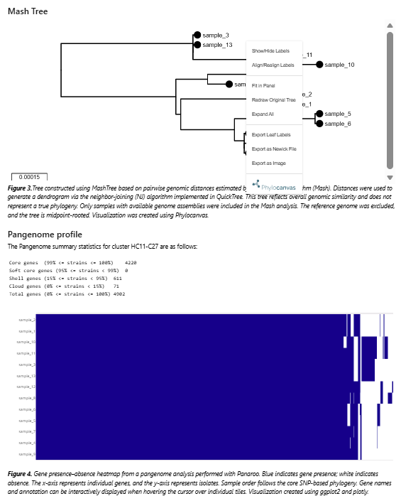
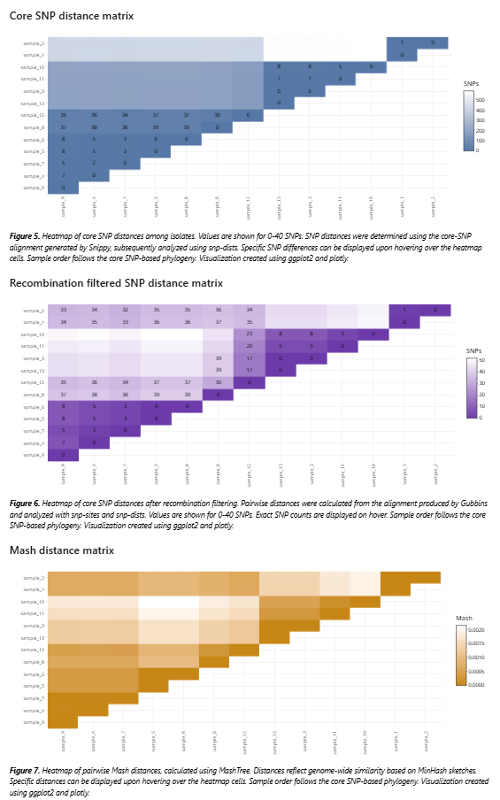
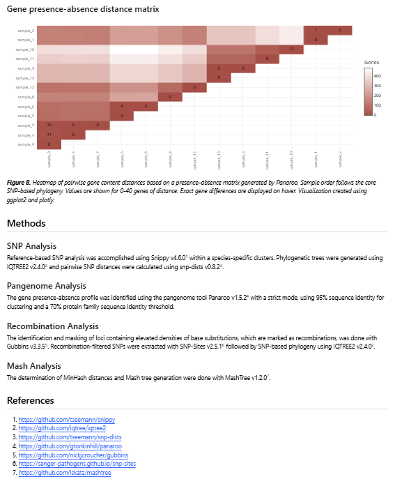

#  

# PoODLE

[](https://www.nextflow.io/)
[](https://www.docker.com/)
[](https://sylabs.io/docs/)
[](https://apptainer.org/docs/user/latest/)


**PoODLE** (Phylogenomic Overview for Detection of Linkages for Epidemiologists) is a Nextflow pipeline designed for genomic surveillance and outbreak investigation of bacterial pathogens, that integrates SNP-based phylogenetics and pangenome analysis to identify **genetically linked isolates** and produce **easy-to-interpret reports** for epidemiologists and microbiologists.

PoODLE is designed for **routine surveillance**, where clusters grow incrementally as new samples arrive.

- Supports **multiple species**
- Processes **multiple clusters in parallel**
- Optimized to **reuse previous results**
- Generates an **interactive HTML report**

---

## 🔎 Recommended upstream step: defining clusters with CorGe+


Before running PoODLE, we **strongly recommend** identifying clusters (genomic context groups) using [**CorGe+**](https://github.com/MDHHS-Bioinformatics/corge). PoODLE is designed for **high-resolution analysis of *pre-defined* clusters**, not for initial large-scale clustering. Running PoODLE on poorly defined or overly broad groups can:

* obscure true transmission signals
* reduce core genome size
* increase computational cost
* complicate epidemiological interpretation

[**CorGe+**](https://github.com/MDHHS-Bioinformatics/corge) is optimized for **speed, scale, and screening**, while PoODLE provides **fine-grained, high-resolution analysis**.

Together, they form a **two-stage surveillance workflow**:

| Step | Tool       | Purpose                                             |
| ---- | ---------- | --------------------------------------------------- |
| 1    | **CorGe+** | Rapid screening and cluster detection               |
| 2    | **PoODLE** | Detailed SNP, recombination filtering, and pangenome analysis |




# Table of Contents
- [Pipeline summary](#-pipeline-summary)
- [Quick Start](#-quick-start)
- [Parameters](#parameters)
- [Output overview](#-output-overview)
- [Key output files](#-key-output-files)
- [Best practices & caveats](#-best-practices--caveats)
- [Citations](#-citations)
- [Credits & Community](#credits--community)
- [License](#-license)


---

## 🧩 Pipeline summary


1. **Reference-based SNP calling (Snippy)**
   * Runs [`Snippy`](https://github.com/tseemann/snippy) per sample within each cluster
   * Automatically detects if results already exist
   * **Reuses previous results** when the same reference was used
     → *This is critical for surveillance workflows where clusters grow over time*

2. **Core genome alignment & SNP distances**
   * [`Snippy`](https://github.com/tseemann/snippy) builds the core genome alignment
   * [`IQ-TREE`](https://www.iqtree.org/) builds a phylogeny
   *  [`snp-dists`](https://github.com/tseemann/snp-dists) calculates pairwise SNP distances

3. **Recombination filtering (optional)**
   * [`Gubbins`](https://github.com/nickjcroucher/gubbins) masks recombinant regions
   * SNP-only alignment is rebuilt with [`snp-sites`](https://sanger-pathogens.github.io/snp-sites/)
   * Phylogenetic tree and SNP distances are generated

4. **Pangenome analysis**
   * [`Panaroo`](https://github.com/gtonkinhill/panaroo) identifies gene presence/absence
   * Gene-based distance matrix is calculated

5. **Whole-genome distance tree (optional)**
   * [`MashTree`](https://github.com/lskatz/mashtree) generates a fast, assembly-based tree

6. **Reporting**
   * A single **interactive HTML report** per cluster
   * Includes trees, distance matrices, and pangenome plots
   * Linkage tables per cluster with SNP alignment quality check, strong, intermediate and lineage level linkages.




---

## ⚡ Quick Start

### 1. Install prerequisites

1. Install [`Nextflow`](https://www.nextflow.io/docs/latest/getstarted.html#installation) (`>=22.10.1`)
2. Install [`Docker`](https://docs.docker.com/engine/installation/) (recommended for local runs) or [`Singularity`](https://www.sylabs.io/guides/3.0/user-guide/)/[`Apptainer`](https://apptainer.org/docs/user/latest/) (recommended for HPC clusters) for full pipeline reproducibility.

> [!NOTE]  
> If using **Singularity/Apptainer** set `NXF_SINGULARITY_CACHEDIR` (or `singularity.cacheDir`) to reuse images later. For example: 
> ```bash
> export NXF_SINGULARITY_CACHEDIR="/path/to/singularity_cache"
> ``````

---

### 2. Prepare your manifest file

PoODLE uses a **CSV manifest file** to define samples, clusters, and references.

Each row represents **one isolate**.

### Required columns

| Column       | Description                                               |
| ------------ | --------------------------------------------------------- |
| `sample`     | Unique sample ID (no spaces)                              |
| `fastq_1`    | Path to read 1 (leave empty if not available)             |
| `fastq_2`    | Path to read 2 (leave empty for single-end or assemblies) |
| `gff`        | GFF annotation file (uncompressed)                        |
| `assembly`   | FASTA assembly (uncompressed)                             |
| `cluster_id` | Cluster identifier (e.g. outbreak or surveillance group)  |
| `species`    | Species name (no spaces recommended)                      |
| `reference`  | Reference genome FASTA for SNP calling                    |

### Supported input types

* **Paired-end reads** → `fastq_1` + `fastq_2`
* **Single-end reads** → `fastq_1` only
* **Assemblies only** → leave both FASTQ columns empty

> [!IMPORTANT]
> Even if FASTQs are missing, **all columns must be present** in the CSV.
> Use QC-trimmed FASTQ files, not raw reads.


### Example manifest

```csv
sample,fastq_1,fastq_2,gff,assembly,cluster_id,species,reference
SAMPLE_1,/path/S1_R1.fastq.gz,/path/S1_R2.fastq.gz,/path/S1.gff,/path/S1.fasta,HC1-C1,Escherichia_coli,/path/ref1.fasta
SAMPLE_2,/path/S2_R1.fastq.gz,/path/S2_R2.fastq.gz,/path/S2.gff,/path/S2.fasta,HC1-C1,Escherichia_coli,/path/ref1.fasta
SAMPLE_3,/path/S3.fastq.gz,,/path/S3.gff,/path/S3.fasta,outbreak_A,Pseudomonas_aeruginosa,/path/ref2.fasta
SAMPLE_4,,,/path/S4.gff,/path/S4.fasta,outbreak_A,Pseudomonas_aeruginosa,/path/ref2.fasta
```

More details in [`docs/usage.md`](docs/usage.md)

> [!WARNING]
> SNPs generated from assemblies may be **inflated or less accurate**.
> **Quality-trimmed reads are strongly recommended** whenever possible.

### 3. Run your analyses

### Basic run
By default only Snippy and Panaroo are run

```bash
nextflow run MDHHS-Bioinformatics/poodle \
  -profile singularity \
  --input manifest.csv \
  --outdir poodle_results 
```

### Advanced
Requesting recombination filtering with Gubbins, MashTree, and custom configuration

```bash
nextflow run MDHHS-Bioinformatics/poodle \
  -profile singularity \
  --input manifest.csv \
  --outdir poodle_results \
  --gubbins \
  --mashtree \
  --max_memory 50.GB \
  --max_cpus 16 \
  --max_time 8.h
  ```

>[!NOTE]
>This command downloads this pipeline to ~/.nextflow/assets/MDHHS-Bioinformatics/poodle. You can download the pipeline in a different location using `git clone https://github.com/MDHHS-Bioinformatics/poodle.git`. To run the pipeline, specify the path to the cloned repository (e.g. `nextflow run /path/to/poodle ...`). More details in [Usage](docs/usage.md)


> [!TIP]
> After a successful run, the `work/` folder inside the working directory can be safely deleted.

## Parameters

### **📥 Input & Core Parameters**

| Parameter          | Required | Default        | Description                                                                                                |
| ------------------ | :------: | -------------- | ---------------------------------------------------------------------------------------------------------- |
| `--input`          |     ✓    | –              | Manifest CSV.                                                                  |
| `--outdir`         |     ✓    | `./poodle_results`   | Output directory root.|
| `--gubbins` |     –    | `false`              | Filter out recombinant sites with Gubbins |
| `--mashtree` |     –    | `false`              | Analyze genomic distances and generate a Mashtree |
| `--logo_report`           |     –    | `assets/DNA_logo.png`      | Logo in PNG format to include in the report header     |
| `--previous_results`     |     –    | –              | Path to previous results. By default, the pipeline looks for prior Snippy results for the same cluster in the outdir.                |
| `--save_snippy_run`     |     –    | `true`              | Do not publish Snippy run results. By default, the pipeline saves the Snippy-run results per sample  |
| `--email`     |     –    | –              | Email address for completion summary  |


### ⚙️ **Execution Configuration**

| Parameter      | Required | Default  | Description                                                                                                                      |
| -------------- | :------: | -------- | -------------------------------------------------------------------------------------------------------------------------------- |
| `-profile`     |     ✓    | –        | Execution profile (`docker` or `singularity` (singularity works also for apptainer)).                                                             |
| `--max_memory` |     ✓    | `128.GB` | Maximum memory allocation.                                                                                                       |
| `--max_cpus`   |     ✓    | `16`     | Maximum CPUs allowed.                                                                                                            |
| `--max_time`   |     ✓    | `24.h`   | Maximum execution time.                                                                                                          |
| `-resume`      |     –    | –        | Reuse cached results from previous runs when inputs and code haven't changed. Ideal for interrupted runs. |

More NextFlow configuration options in [`docs/usage.md`](docs/usage.md)


## 📊 Output overview

Results are organized by **species** and **cluster**:

```text
📁 <outdir>/
└── 📁 <Species>/
    └── 📁 <cluster_id>/
        ├── 📁 snippy_core/
        ├── 📁 snippy_run/
        ├── 📁 panaroo/
        ├── 📁 gubbins/
        ├── 📁 mashtree/
        ├── 📁 linkages/
        └── 📄<Species>_<cluster_id>.html
```

Details about outputs can be found in [`output.md`](docs/output.md) and the full output tree in [`poodle_outputs.md`](docs/poodle_outputs.md).

---

## 🔑 Key output files

PoODLE generates several output files to support surveillance and linkage interpretation.

### **📘 Genomic linkages**

**File:**
`<Species>_<cluster_id>_<snippy|gubbins>_linkages.csv`

Classifies isolate pairs based on **SNP distance thresholds** commonly used in outbreak investigations.

| Column                  | Description          |
| ----------------------- | -------------------- |
| `sample`                | Sample ID            |
| `species`               | Species              |
| `cluster_id`            | Cluster              |
| `ref_genome_fraction`   | % of reference covered |
| `ref_alignment_qc`      | PASS, WARN or FAIL   |
| `min_dist`              | Minimum SNP distance |
| `strong_linkages`       | 0–10 SNPs            |
| `intermediate_linkages` | 11–40 SNPs           |
| `lineage_level`         | 41–150 SNPs          |

 Reference alignment quality flag derived from `ref_genome_fraction`:

  * **PASS**: ≥ 95%
  * **WARN**: 90–94.9%
  * **FAIL**: < 90%

Reference-genome fraction < 90% may indicate:
- the sample does not belong to the cluster
- the reference is too distantly related
- multiple lineages are being grouped together
- the linkages may be inaccurate due to core genome shrinkage

>[!TIP]
>If many samples show WARN or FAIL alignment QC, consider: changing the reference or splitting the cluster into sub-clusters. Using a **reference from within the cluster** is strongly recommended to avoid core genome shrinkage.

### **📗 HTML report**

**File:**
`<Species>_<cluster_id>.html`

Includes:
* Phylogenetic trees (phylocanvas)
* SNP and gene distance matrices (plotly)
* Pangenome results and heatmap (plotly)
* Methods






---

## 🧠 Best practices & caveats

* **Use high-quality sequences:** Ideally, assemblies should have **<500 contigs ≥500 bp**, reads **≥30× Illumina coverage**, and **no contamination**. Pipelines like [`PHoeNIX`](https://github.com/CDCgov/phoenix), [`Bactopia`](https://bactopia.github.io/latest/) and [`TheiaProk`](https://public-health-bacterial-genomics-theiagen.readthedocs.io/en/latest/theiaprok.html) provide quality checks.

* **Disk cleanup:** After the pipeline completes, you may safely remove the Nextflow `work/` directory to reclaim space.

* Prefer **reads over assemblies** for SNP analysis
* Use **internal references** whenever possible
* Run with `--gubbins` for highly recombinant species
* Interpret SNP thresholds **in epidemiological context**, not in isolation
* A genomic cluster should contain > 4 closely related samples. We strongly recommend using PoODLE after [`CorGe+`](https://github.com/MDHHS-Bioinformatics/corge), since CorGe+ identifies genomic context groups at different thresholds.

---

## 📚 Citations

If you use PoODLE, please cite:

* [`Snippy`](https://github.com/tseemann/snippy) - SNP calling
* [`Panaroo`](https://github.com/gtonkinhill/panaroo) - pangenome analysis
* [`MashTree`](https://github.com/lskatz/mashtree) - composition-based tree
* [`Gubbins`](https://github.com/nickjcroucher/gubbins) - genome recombination filtering
* [`snp-dists`](https://github.com/tseemann/snp-dists) -  SNP distance calculation
* [`snp-sites`](https://sanger-pathogens.github.io/snp-sites/) - AGTC position extractions
* [`IQ-TREE`](https://www.iqtree.org/) - phylogeny
* [`nf-core`](https://nf-co.re/) - bioinformatics pipeline framework
* [`NextFlow`](https://www.nextflow.io/docs/latest/index.html) - computational workflow
* Software packaging/containerization tools

An extensive list of references for the tools used by the pipeline can be found in the [`CITATIONS.md`](CITATIONS.md) file.


## Credits & Community

PoODLE was built and is maintained by the Genomics Analysis Unit at the Michigan Department of Health & Human Services (MDHHS). This pipeline was developed by [Karla Vasco](https://github.com/vascokarla) and [Douglas Maldonado-Torres](https://github.com/MTDouglas). Contributions, issues, and pull requests are welcome!


## Disclaimer
This repository is not a source of government records but is intended to increase collaboration and collaborative potential on public health related projects. Materials and information in this repository are intended to share information and collaboratively develop analysis workflows. 

The workflows and pipelines reflect the current understanding of the software and biological questions being answered and may be updated as needed and pursuant to further analysis and review. No warranty, expressed or implied, is made by Michigan Department of Health & Human Services (MDHHS) Bureau of Laboratories as to the functionality of the software and related material nor shall the fact of release constitute any such warranty. Furthermore, the software is released on condition that the MDHHS Bureau of Laboratories shall not be held liable for any damages resulting from its authorized or unauthorized use. 


## Privacy Notice
Use of this service is limited only to non-sensitive and publicly available data. Users must not use, share, or store any kind of sensitive data like health status, provision or payment of healthcare, Personally Identifiable Information (PII) and/or Protected Health Information (PHI), etc. under any circumstance.
## 📜 License

This project is released under the [**MIT License**](LICENSE).
