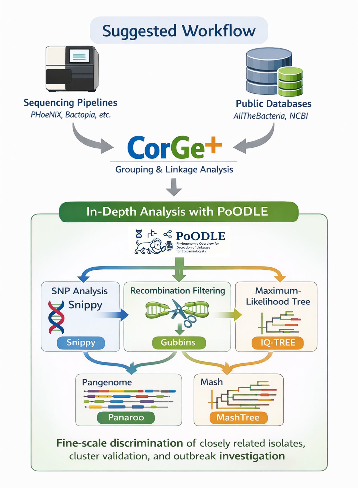
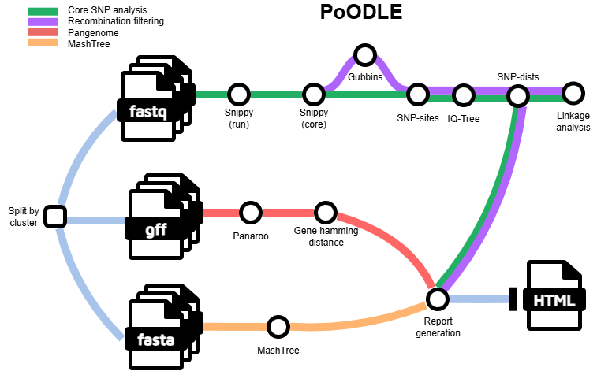

#  

# 🧬 PoODLE

[](https://www.nextflow.io/)
[](https://www.docker.com/)
[](https://sylabs.io/docs/)
[](https://apptainer.org/docs/user/latest/)
[](LICENSE)
[](https://github.com/MDHHS-Bioinformatics/poodle/releases)

[](...)

**PoODLE** (Phylogenomic Overview for Detection of Linkages for Epidemiologists) is a bioinformatics pipeline that can be used to analyze DNA sequencing data obtained from bacteria for cluster analyses. It takes a samplesheet with reads (FASTQ), annotation (GFF/GBK), and assembly (FASTA) files of multiple isolates from the same cluster as input; performs variant calling, pangenome analysis, recombination filtering, mash analysis, and phylogeny and produces linkage tables and a comprehensive report per cluster. 

### Suggested workflow

Genomes analyzed with sequencing pipelines (e.g., PHoeNIx, Bactopia, TheiaProk, or custom workflows) or obtained from public repositories (e.g., AllTheBacteria, NCBI) can be analyzed with [`CorGe+`](https://github.com/MDHHS-Bioinformatics/corge) or with other clustering pipelines to identify preliminary genetic groupings and prioritize related samples.

These grouped isolates can then be analyzed with **PoODLE** which enables detailed within-group investigation through SNP-based approaches and pangenome analysis, supporting fine-scale discrimination of closely related isolates. This workflow enables downstream interpretation, providing the resolution needed for routine surveillance, cluster validation, and outbreak investigation.

<p align="center">

</p>


## 🌟 Highlights
- Processes **multiple species and clusters in parallel**
- Optimized to **reuse previous variant calling results** (useful in routine surveillance, where clusters grow incrementally)
- Generates  **HTML reports** and **linkage tables** to facilitate interpretations

## 📊 Workflow Overview


High-level steps:
1. Reference-based SNP calling with [`Snippy`](https://github.com/tseemann/snippy)
2. Recombination filtering with [`Gubbins`](https://github.com/nickjcroucher/gubbins) (optional)
3. Constant site calculation from genome alignment with [`snp-sites`](https://sanger-pathogens.github.io/snp-sites/)
4. Phylogeny with [`IQ-TREE`](https://www.iqtree.org/)
5. Pairwise SNP distance calculation with [`snp-dists`](https://github.com/tseemann/snp-dists) 
6. Pangenome analysis with [`Panaroo`](https://github.com/gtonkinhill/panaroo)
7. Whole-genome distance tree with [`MashTree`](https://github.com/lskatz/mashtree) (optional) 
8. Report generation including trees, distance matrices, and pangenome plots

For full workflow details check [`Workflow documentation`](docs/workflow.md)

---

## 🚀 Usage

### 1️⃣ Requirements

* [`Nextflow`](https://docs.seqera.io/nextflow/install) (`>=22.10.1`)
* One container runtime:
  * [`Docker`](https://docs.docker.com/engine/installation/) (recommended for local runs)
  * [`Apptainer`](https://apptainer.org/docs/user/latest/) (recommended for HPC)
  * [`Singularity`](https://www.sylabs.io/guides/3.0/user-guide/)

### 2️⃣ Prepare samplesheet
Prepare a samplesheet (CSV) to define sample files, clusters, and references:

**Input format description**

| Column       | Description                                               |
| ------------ | --------------------------------------------------------- |
| `sample`     | Unique sample ID                                          |
| `fastq_1`    | Path to read 1 (leave empty if not available)             |
| `fastq_2`    | Path to read 2 (leave empty for single-end or assemblies) |
| `annotation` | Annotation file (GFF or Genbank format, can be gzipped)   |
| `assembly`   | FASTA assembly (can be gzipped)                           |
| `cluster_id` | Cluster identifier (e.g. outbreak or surveillance group)  |
| `species`    | Species name                                              |
| `reference`  | Reference genome FASTA for SNP calling (can be gzipped)   |

```csv
sample,fastq_1,fastq_2,annotation,assembly,cluster_id,species,reference
SAMPLE_1,/path/S1_R1.fastq.gz,/path/S1_R2.fastq.gz,/path/S1.gff,/path/S1.fasta,HC1-C1,Escherichia_coli,/path/ref1.fasta
SAMPLE_2,/path/S2_R1.fastq.gz,/path/S2_R2.fastq.gz,/path/S2.gff,/path/S2.fasta,HC1-C1,Escherichia_coli,/path/ref1.fasta
SAMPLE_3,/path/S3.fastq.gz,,/path/S3.gff,/path/S3.fasta,outbreak_A,Pseudomonas_aeruginosa,/path/ref2.fasta
SAMPLE_4,,,/path/S4.gff,/path/S4.fasta,outbreak_A,Pseudomonas_aeruginosa,/path/ref2.fasta
```

_Supported input types for variant calling_

[`Snippy`](https://github.com/tseemann/snippy) supports the following inputs:
* **Paired-end reads** → `fastq_1` + `fastq_2`
* **Single-end reads** → `fastq_1` only
* **Assemblies only** → leave both FASTQ columns empty

> [!IMPORTANT]
> - Even if FASTQs are missing, **all columns must be present** in the CSV.
> - Use QC-trimmed FASTQ files, not raw reads.
> - All samples from the **same cluster should share** the same `species`, `cluster_id` and `reference` file.


> [!WARNING]
> SNPs generated from assemblies may be **inflated or less accurate**.
> **Quality-trimmed reads are strongly recommended** whenever possible.

_Supported annotation types for pangenome profiling_

[`Panaroo`](https://github.com/gtonkinhill/panaroo) supports the following annotation formats:
* **GFF3** (from Prokka or Bakta, with embedded FASTA) → use `--annotation_format gff` _(default)_
* **GFF3 without embedded FASTA** (e.g., from RefSeq) → use `--annotation_format split_gff`
* **GenBank files** (.gb, .gbk, .gbff)  → use `--annotation_format genbank`

> [!NOTE]
> All samples within a run must use the same annotation format.


### 3️⃣ Run
Now, you can run the pipeline using:

```bash
nextflow run MDHHS-Bioinformatics/poodle \
  -profile singularity \
  --input samplesheet.csv \
  --outdir poodle_results \
  --gubbins \
  --mashtree
```

This will execute the core analysis workflow which include variant calling and pangenome analysis. Optional analyses (recombination filtering with Gubbins and Mash analysis) are enabled with `--gubbins` and `--mashtree`.


For more details and further functionality, please refer to [`Usage documentation`](docs/usage.md) and the [`Parameter documentation`](docs/parameters.md)


## 📂 Outputs
Results are organized by **species** and **cluster**:


```text
📁 <outdir>/
└── 📁 <Species>/
    └── 📁 <cluster_id>/
        ├── 📁 snippy_core/
        ├── 📁 snippy_run/
        ├── 📁 panaroo/
        ├── 📁 gubbins/
        ├── 📁 mashtree/
        ├── 📁 linkages/
        └── 📄<Species>_<cluster_id>.html
```
Key outputs:
* HTML report
* Distance matrices
* Linkage summary tables

For more details about the output files and reports, please refer to the [`Output documentation`](docs/output.md)


## 👥 Credits

PoODLE was built and is maintained by the Genomics Analysis Unit at the Michigan Department of Health & Human Services (MDHHS) Bureau of Laboratories. This pipeline was developed by [Douglas Maldonado-Torres](https://github.com/MTDouglas) and [Karla Vasco](https://github.com/vascokarla) using the nf-core template.


## 🤝 Contributions
Contributions, issues, and pull requests are welcome! If you would like to contribute to this pipeline, please see the [`Contribution guidelines`](CONTRIBUTING.md). 

## 📚 Citations

If you use PoODLE for your analysis, please cite the following doi:

Maldonado-Torres D. & Vasco K. (2026). 
MDHHS-Bioinformatics/poodle: v1.0.0 (v1.0.0). 
Zenodo. https://doi.org/XX.XXX/zenodo.XXXX

An extensive list of references for the tools used by the pipeline can be found in [`CITATIONS.md`](CITATIONS.md).

## ⚠️ Disclaimer
This repository is not a source of government records but is intended to increase collaboration and collaborative potential on public health related projects. Materials and information in this repository are intended to share information and collaboratively develop analysis workflows. 

The workflows and pipelines reflect the current understanding of the software and biological questions being answered and may be updated as needed and pursuant to further analysis and review. No warranty, expressed or implied, is made by MDHHS Bureau of Laboratories as to the functionality of the software and related material nor shall the fact of release constitute any such warranty. Furthermore, the software is released on condition that the MDHHS Bureau of Laboratories shall not be held liable for any damages resulting from its authorized or unauthorized use. 


## 🔒 Privacy Notice
Use of this service is limited only to non-sensitive and publicly available data. Users must not use, share, or store any kind of sensitive data like health status, provision or payment of healthcare, Personally Identifiable Information (PII) and/or Protected Health Information (PHI), etc. under any circumstance.

## 📜 License
This project is released under the [**MIT License**](LICENSE).
